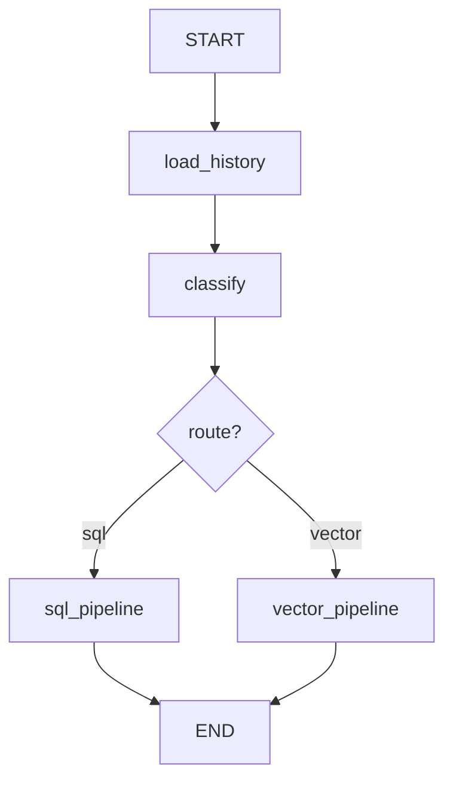
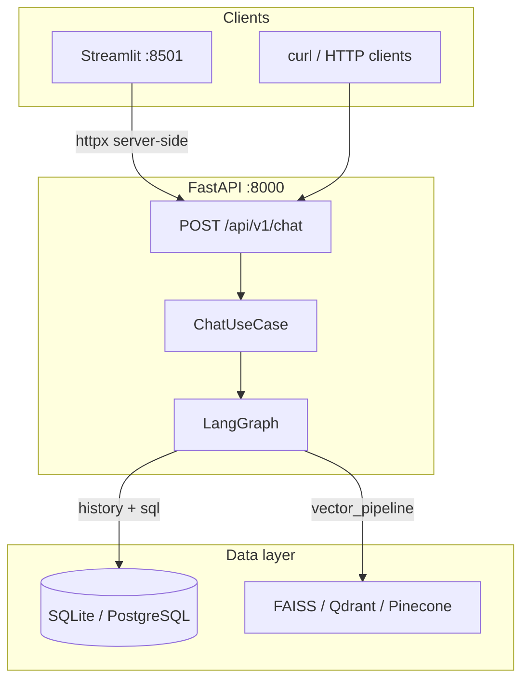

# Hybrid Intelligent Chatbot

**Production-grade hybrid RAG API** — routes every query down exactly one path: **SQL** (structured data) or **Vector** (document search). Pipelines never mix.

Built for GenAI Engineer Assessment II with hexagonal architecture, LangGraph orchestration, multi-provider LLM support, and a Streamlit assessment UI.

---

## Quick Start

**Prerequisites:** Python 3.11+, `make`. Docker is optional (required only for the Docker path).

Copy environment config and add your API key:

```bash
cp .env.example .env   # then set OPENAI_API_KEY
```

### Local — no Docker

SQLite + FAISS on disk. No containers, no Postgres install.

```bash
make local
```

Then start the services (two terminals):

```bash
make run        # Terminal 1 — API  → http://localhost:8000/docs
make streamlit  # Terminal 2 — UI   → http://localhost:8501
```

### Docker — full stack

PostgreSQL + FastAPI + Streamlit + FAISS. Requires Docker Desktop (or Docker Engine + Compose v2).

```bash
make docker
```

| Endpoint | URL |
|----------|-----|
| OpenAPI / Swagger | http://localhost:8000/docs |
| Readiness probe | http://localhost:8000/ready |
| Streamlit UI | http://localhost:8501 |

Both paths bootstrap automatically: **migrate → seed → index documents**. Run `make doctor` (local) or `make down && make docker` (Docker) if anything looks off.

**Vector backend variants (Docker only):**

```bash
make up-qdrant    # adds Qdrant container (Compose profile)
make up-pinecone  # managed Pinecone (set PINECONE_* in .env)
```

---

## Deployment Modes

| | **Local** (`make local`) | **Docker** (`make docker`) |
|--|--------------------------|----------------------------|
| **Command** | `make local` | `make docker` |
| **Structured DB** | SQLite (`data/local.db`) | PostgreSQL 16 (container) |
| **Vector store** | FAISS (`data/faiss/`) | FAISS (bind-mounted `./data`) |
| **API** | `make run` (hot reload) | Uvicorn in `app` container |
| **UI** | `make streamlit` | `streamlit` container |
| **Docker required** | No | Yes |

Compose injects `DATABASE_URL=postgresql+asyncpg://…@postgres:5432/chatbot`, overriding any local SQLite defaults in `.env`.

---

## Overview

| Capability | Implementation |
|------------|----------------|
| Query routing | LLM structured classifier + pure rule fallback |
| SQL pipeline | LangChain NL→SQL → read-only execution → NL answer |
| Vector pipeline | FAISS / Qdrant / Pinecone RAG with source attribution |
| Multi-turn chat | DB-backed `conversation_messages` via LangGraph `load_history` |
| Streamlit UI | Quick Tests, Demo Script, routing badges, session management |
| Multi-provider LLM | OpenAI, Anthropic, Google — auto-selected by API key |

---

## Production Features

| Feature | Details |
|---------|---------|
| Orchestration | LangGraph: `load_history` → `classify` → exactly one of `sql_pipeline` \| `vector_pipeline` |
| Routing policy | Hybrid classifier + policy pre-check + confidence threshold fallback |
| Observability | structlog JSON logs — `request_id`, `X-Correlation-ID`, `duration_ms`, `client_ip` |
| Health probes | `GET /health` (liveness) · `GET /ready` (readiness, **503** when DB/vector degraded) |
| Security | Rate limiting, CORS, security headers, SQL guardrails, sanitized error responses |
| Stub profile | No API keys → rule-based classifier + stub pipelines (same routing rules) |
| Quality gate | `make all` — ruff + mypy + pytest with coverage |

---

## Security

| Control | Details |
|---------|---------|
| Rate limiting | SlowAPI on `POST /api/v1/chat` — **10 req/min/IP** default (`RATE_LIMIT_*`) |
| CORS | `CORS_ORIGINS`; permissive only when `APP_DEBUG=true` |
| Security headers | `X-Content-Type-Options`, `X-Frame-Options`, `CSP`, `Referrer-Policy` |
| SQL guardrails | SELECT/WITH only, keyword blacklist, single statement — [`sql_guard.py`](src/application/security/sql_guard.py) |
| Error responses | `{ error, message, request_id }` — no stack traces leaked |
| Dependency audit | `make security-audit` — [pip-audit](https://pypi.org/project/pip-audit/) on `requirements.txt` |

Docker Compose enables rate limiting, `/ready` probes, and `restart: unless-stopped` on all services.

---

## Architecture

### Hexagonal (Ports & Adapters)

```
domain/          Pure entities & exceptions — zero framework imports
application/     Ports, LangGraph orchestrator, pure routing rules
adapters/        FastAPI, LangChain chains, SQL/vector/LLM implementations
infrastructure/  Config, DI, migrations, seed, indexing
```

- **Swappable backends** — FAISS ↔ Qdrant ↔ Pinecone, OpenAI ↔ Anthropic ↔ Google via config
- **Testability** — stub pipelines and mock ports without touching business logic
- **Enforced boundaries** — `tests/test_hexagonal_boundaries.py` fails on forbidden imports in `application/`

LangChain LCEL lives exclusively under `src/adapters/llm/chains/`. Routing rules are pure Python in `src/application/routing/`.

### LangGraph state machine



Each pipeline node validates output contracts: SQL returns `sources: []`; Vector returns `sql_query: null`. Mutual exclusion is enforced in graph edges and tested in `tests/test_graph_mutual_exclusion.py`.

### Full stack



Streamlit calls the API **server-side** (`BACKEND_URL`), so browser CORS is not required for the UI.

### Docker services

| Service | Port | Role |
|---------|------|------|
| `postgres` | 5432 | Structured data + conversation history |
| `qdrant` | 6333 | Vector index (`make up-qdrant`, Compose profile) |
| `app` | 8000 | FastAPI + LangGraph |
| `streamlit` | 8501 | Assessment demo UI |

---

## Routing

| Route | When | Response shape |
|-------|------|----------------|
| **SQL** | Aggregations, counts, filters, revenue, dates | `answer`, `sql_query`, `sources: []` |
| **Vector** | Policies, FAQs, product docs, warranty, support | `answer`, `sources`, `sql_query: null` |

**Hybrid classifier** (`LLMQueryClassifier`):

1. Policy-intent pre-check → Vector (skip LLM for known edge cases)
2. LLM structured classify
3. Rule-based fallback when confidence is low, LLM returns SQL on a policy query, or LLM fails

**Edge-case rule:** Queries mentioning table words (`orders`, `customers`) but asking about **policy/process** → **Vector**.

Pure rules: `src/application/routing/rules.py` · Contracts: `src/application/routing/contracts.py`

---

## Configurable Vector Store

Switch via `VECTOR_STORE_BACKEND` — factory in [`src/adapters/vector/factory.py`](src/adapters/vector/factory.py). Re-index after changing backend.

| Backend | Use case | Make target |
|---------|----------|-------------|
| **FAISS** | Local + default Docker | `make local` / `make docker` |
| **Qdrant** | Production-like vector service | `make up-qdrant` |
| **Pinecone** | Managed cloud index | `make up-pinecone` |

---

## Streamlit UI

After starting the API and UI (local or Docker):

| Feature | Description |
|---------|-------------|
| **Quick Tests** | One-click buttons for all 7 assessment queries |
| **Demo Script** | Numbered walkthrough with Run per step + cURL blocks |
| **Settings** | Dark mode, backend URL, conversation ID, new session |
| **Chat** | Route badges (SQL / VECTOR), confidence pill, Show SQL, source chips |

```
┌─────────────────────────────────────────────────────────────────┐
│  Hybrid Intelligent Chatbot              [ Online | Offline ] │
├──────────────┬──────────────────────────────────────────────────┤
│ Sidebar      │  Chat                                            │
│ [Quick Tests]│  👤 user bubble                                  │
│ [Settings]   │  🤖 assistant + [SQL|VECTOR] badge · confidence  │
│ [Demo Script]│  □ Show SQL · source chips                       │
│ Clear chat   │  [ Ask about revenue, policies… ]                │
└──────────────┴──────────────────────────────────────────────────┘
```

Optional portfolio screenshot: save as [`docs/images/streamlit-demo.png`](docs/images/streamlit-demo.png) after `make docker`.

---

## Environment Variables

| Variable | Default | Description |
|----------|---------|-------------|
| `OPENAI_API_KEY` | — | OpenAI chat + embeddings |
| `LLM_PROVIDER` | `auto` | `auto` \| `openai` \| `anthropic` \| `google` |
| `VECTOR_STORE_BACKEND` | `faiss` | `faiss` \| `qdrant` \| `pinecone` |
| `DATABASE_URL` | *(SQLite)* | Unset → `sqlite+aiosqlite:///data/local.db`; Docker sets PostgreSQL |
| `SQLITE_PATH` | `data/local.db` | SQLite file when `DATABASE_URL` is unset |
| `CONVERSATION_REPOSITORY` | `postgres` | `postgres` \| `memory` (tests / ephemeral) |
| `CLASSIFIER_CONFIDENCE_THRESHOLD` | `0.7` | Rule fallback below this confidence |
| `RATE_LIMIT_ENABLED` | `true` | Rate limit `POST /api/v1/chat` |
| `BACKEND_URL` | `http://localhost:8000` | API URL for Streamlit |
| `APP_DEBUG` | `false` | Enables `POST /api/v1/classify` debug endpoint |
| `LANGSMITH_TRACING` | `false` | Enable LangSmith tracing (requires `LANGSMITH_API_KEY`) |
| `LANGSMITH_API_KEY` | — | LangSmith API key (also accepts `LANGCHAIN_API_KEY`) |
| `LANGSMITH_PROJECT` | `APP_NAME` | LangSmith project name for trace grouping |

Multi-turn chats are grouped in LangSmith **Threads** using the API `conversation_id` as `thread_id` (reuse the same `conversation_id` across requests).

See [`.env.example`](.env.example) for the full list including Pinecone, Qdrant, LangSmith, and CORS.

---

## API Reference

### POST /api/v1/chat

```json
{ "query": "What is the total revenue this month?", "conversation_id": null }
```

**SQL response:**

```json
{
  "answer": "Total revenue this month is $12,450 across 47 orders.",
  "route": "sql",
  "confidence": 0.92,
  "sources": [],
  "sql_query": "SELECT SUM(amount) FROM orders WHERE …",
  "conversation_id": "3fa85f64-5717-4562-b3fc-2c963f66afa6"
}
```

**Vector response:**

```json
{
  "answer": "We offer a 30-day return policy…",
  "route": "vector",
  "confidence": 0.94,
  "sources": ["return_policy.md"],
  "sql_query": null,
  "conversation_id": "3fa85f64-5717-4562-b3fc-2c963f66afa6"
}
```

| Endpoint | Purpose |
|----------|---------|
| `GET /health` | Liveness — process up, provider info |
| `GET /ready` | Readiness — DB + vector store (**503** if degraded) |
| `POST /api/v1/classify` | Debug routing (`APP_DEBUG=true`) |

### Assessment queries

| Query | Expected `route` |
|-------|------------------|
| Total revenue this month? | `sql` |
| Top 5 customers by spending | `sql` |
| Orders placed in the last 7 days | `sql` |
| What is your return policy? | `vector` |
| Explain product features | `vector` |
| Tell me about orders policy | `vector` |
| Customers refund issues | `vector` |

```bash
curl -s -X POST http://localhost:8000/api/v1/chat \
  -H "Content-Type: application/json" \
  -d '{"query": "Tell me about orders policy"}' | jq .
```

Same queries are available as sidebar buttons in the Streamlit UI.

---

## Development

```bash
make all               # Quality gate: ruff + mypy + pytest (run before submit)
make test              # Full suite with coverage
make test-unit         # Unit tests only
make lint              # Ruff + mypy
make format            # Auto-format
make security-audit    # pip-audit CVE scan
```

Key test modules: `test_routing_rules.py`, `test_classifier_hybrid.py`, `test_graph_mutual_exclusion.py`, `test_sql_guard.py`, `test_hexagonal_boundaries.py`.

---

## Make Targets

| Target | Description |
|--------|-------------|
| **`local`** | **One-shot local bootstrap** — venv + SQLite migrate/seed + FAISS index |
| **`docker`** | **One-shot Docker bootstrap** — build + Postgres + API + Streamlit + FAISS |
| `run` | Local uvicorn with hot reload |
| `streamlit` | Local Streamlit UI (requires API on `BACKEND_URL`) |
| `doctor` | Diagnose local setup (venv, DB, vector backend) |
| `down` | Stop Docker containers |
| `up-qdrant` / `up-pinecone` | Docker with alternate vector backends |
| `migrate` / `seed` / `index` | Individual bootstrap steps (Docker) |
| `stop-backend` / `stop-streamlit` | Free ports 8000 / 8501 |
| `logs` / `logs-streamlit` | Tail container logs |

Run `make help` for the full list.

---

## Project Structure

```
├── src/
│   ├── main.py                     # FastAPI entry (uvicorn src.main:app)
│   ├── domain/                     # Entities & exceptions (pure Python)
│   ├── application/
│   │   ├── ports/                  # Hexagonal interfaces
│   │   ├── routing/                # Pure rules + output contracts
│   │   ├── graph.py                # LangGraph state machine
│   │   ├── orchestrator.py         # ChatOrchestrator facade
│   │   └── usecases/chat.py        # Chat use case
│   ├── adapters/
│   │   ├── llm/chains/             # LangChain LCEL (classifier, SQL, RAG)
│   │   ├── persistence/            # SQL executor + pipeline adapter
│   │   ├── vector/                 # FAISS / Qdrant / Pinecone
│   │   ├── api/routes/             # FastAPI endpoints
│   │   └── repositories/           # Conversation storage
│   └── infrastructure/             # Config, DI, seed, indexing, migrations
├── frontend/                       # Streamlit UI
├── alembic/                        # Schema migrations
├── tests/                          # Unit + integration tests
├── Makefile                        # local · docker · quality targets
├── docker-compose.yml              # Postgres, app, streamlit (+ qdrant profile)
└── .env.example
```

---

## Troubleshooting

| Issue | Fix |
|-------|-----|
| Local bootstrap fails | `make doctor` — checks venv, SQLite path, vector backend |
| `Address already in use` (:8000) | `make stop-backend` then `make run` |
| Port 8501 unavailable | `make stop-streamlit` then `make streamlit` |
| Stub routing / no LLM | Set `OPENAI_API_KEY` in `.env` |
| Docker won't start | Ensure Docker Desktop is running; `make down && make docker` |
| Postgres errors (Docker) | `make down && make docker` re-runs migrate + seed |
| Vector index empty on `/ready` | Re-run bootstrap: `make local-init` or `make index` |
| Qdrant / Pinecone errors | Use `make up-qdrant` or `make up-pinecone` with correct `.env` keys |

---

## Tech Stack

| Layer | Technology |
|-------|------------|
| API | FastAPI, Pydantic v2, Uvicorn |
| Orchestration | LangGraph |
| LLM / RAG | LangChain LCEL (adapters only) |
| Structured data | SQLite (local) / PostgreSQL 16 (Docker), SQLAlchemy async, Alembic |
| Vector search | FAISS / Qdrant / Pinecone |
| Config | pydantic-settings |
| UI | Streamlit |

---

## License

MIT
