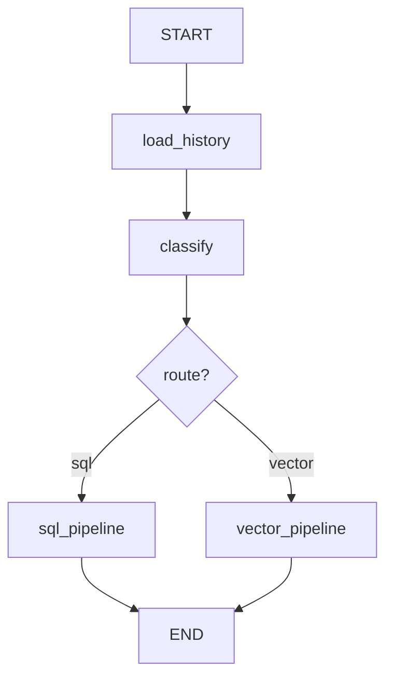

# Hybrid Intelligent Chatbot

Production-ready FastAPI backend for **GenAI Engineer Assessment II** — a hybrid chatbot that routes each query down exactly one path: **SQL** (structured PostgreSQL data) or **Vector** (semantic document search). Pipelines never mix.

---

## Overview

| Capability | Implementation |
|------------|----------------|
| Query routing | LLM classifier + rule-based fallback for edge cases |
| SQL pipeline | LangChain NL→SQL → read-only Postgres execution → NL answer |
| Vector pipeline | FAISS (local) or Qdrant (Docker) RAG with grounded responses |
| Multi-turn chat | Conversation history loaded into LangGraph before classification |
| Multi-provider LLM | OpenAI, Anthropic, Google — auto-selected by API key |

---

## Architecture Decisions

### Why Hexagonal (Ports & Adapters)

The **domain** layer holds pure entities and exceptions — no LangChain, LangGraph, or database imports. **Application** defines ports (interfaces) and orchestration. **Adapters** implement those ports for Postgres, Qdrant, OpenAI, etc.

This gives us:

- **Swappable backends** — switch FAISS ↔ Qdrant or OpenAI ↔ Anthropic via config, not refactors
- **Testability** — stub pipelines and mock ports without touching business logic
- **Clear boundaries** — infrastructure details never leak into routing rules

### Why LangGraph

Routing is a **state machine**, not a simple `if/else`:

```
START → load_history → classify → [sql_pipeline | vector_pipeline] → END
```

LangGraph makes the flow explicit and auditable:

- Each node is a single responsibility (load history, classify, run pipeline)
- Conditional edges enforce **strict mutual exclusion** — a query never hits both pipelines
- Multi-turn memory is a first-class `load_history` node, not an afterthought

### Why LangChain LCEL (inside adapters only)

LangChain is confined to **adapters** — structured classifier output, SQL generation, and RAG chains. The application layer depends on ports, not LangChain types.

---

## Routing Strategy



| Route | When | Returns |
|-------|------|---------|
| **SQL** | Aggregations, counts, filters, rankings, revenue, dates | `answer`, `sql_query`, `sources: []` |
| **Vector** | Policies, FAQs, product docs, warranty, support | `answer`, `sources`, `sql_query: null` |

**Classifier:** LLM structured output (primary) → rule-based fallback when confidence is low or LLM fails.

**Edge-case rule:** Queries mentioning table words (`orders`, `customers`) but asking about **policy/process** → **Vector**.

---

## Tech Stack

| Layer | Technology |
|-------|------------|
| API | FastAPI, Pydantic v2, Uvicorn |
| Orchestration | LangGraph |
| LLM / RAG | LangChain LCEL |
| Structured data | PostgreSQL 16, SQLAlchemy async, Alembic |
| Vector search | FAISS (local) / Qdrant (Docker) |
| Config | pydantic-settings |

---

## Ports Reference

| Port | Adapter |
|------|---------|
| `ClassifierPort` | `LLMQueryClassifier` |
| `SQLPipelinePort` | `LangChainSQLPipelineAdapter` |
| `VectorPipelinePort` | `LangChainVectorPipelineAdapter` |
| `SQLExecutorPort` | `PostgresAdapter` |
| `VectorStorePort` | `FaissVectorAdapter` / `QdrantVectorAdapter` |
| `ChatModelPort` | OpenAI / Anthropic / Google providers |
| `EmbeddingPort` | OpenAI / Google providers |
| `ConversationRepositoryPort` | `InMemoryConversationRepository` |

---

## Quick Start — Docker (recommended for assessment)

```bash
cp .env.example .env          # set OPENAI_API_KEY
make build && make up         # starts postgres + qdrant + app, migrates, seeds, indexes
open http://localhost:8000/docs
```

`make up` waits for health checks, then runs migrations, seed data, and document indexing automatically.

## Quick Start — Local (no app container)

```bash
make setup                    # .venv + dependencies
make postgres-up              # Postgres on localhost:5432
make local-init               # migrate + seed + FAISS index
make run                      # uvicorn with hot reload
```

Run `make doctor` if anything fails.

---

## Environment Variables

| Variable | Default | Description |
|----------|---------|-------------|
| `OPENAI_API_KEY` | — | OpenAI chat + embeddings |
| `LLM_PROVIDER` | `auto` | `auto` \| `openai` \| `anthropic` \| `google` |
| `VECTOR_STORE_BACKEND` | `faiss` | `faiss` (local) \| `qdrant` (Docker) |
| `CLASSIFIER_CONFIDENCE_THRESHOLD` | `0.7` | Fallback to rules below this |
| `CONVERSATION_HISTORY_LIMIT` | `10` | Max prior turns loaded into context |
| `APP_DEBUG` | `false` | Enables `POST /api/v1/classify` debug endpoint |

See [`.env.example`](.env.example) for the full list.

---

## API Reference

### POST /api/v1/chat

**Request:**
```json
{
  "query": "What is the total revenue this month?",
  "conversation_id": null
}
```

**SQL response example:**
```json
{
  "answer": "Total revenue this month is $12,450 across 47 orders.",
  "route": "sql",
  "confidence": 0.92,
  "sources": [],
  "sql_query": "SELECT SUM(amount) FROM orders WHERE order_date >= date_trunc('month', CURRENT_DATE)",
  "conversation_id": "3fa85f64-5717-4562-b3fc-2c963f66afa6"
}
```

**Vector response example:**
```json
{
  "answer": "We offer a 30-day return policy for all products in original condition.",
  "route": "vector",
  "confidence": 0.94,
  "sources": ["return_policy.md"],
  "sql_query": null,
  "conversation_id": "3fa85f64-5717-4562-b3fc-2c963f66afa6"
}
```

**Edge-case response example:**
```json
{
  "answer": "Our orders policy covers processing times, cancellations, and refund eligibility...",
  "route": "vector",
  "confidence": 0.87,
  "sources": ["faq_support.md"],
  "sql_query": null,
  "conversation_id": "3fa85f64-5717-4562-b3fc-2c963f66afa6"
}
```

### GET /health — liveness (provider info)

### GET /ready — readiness (Postgres + providers)

### POST /api/v1/classify — debug routing (`APP_DEBUG=true`)

```bash
curl -X POST http://localhost:8000/api/v1/classify \
  -H "Content-Type: application/json" \
  -d '{"query": "Tell me about orders policy"}'
```

```json
{
  "route": "vector",
  "route_label": "VECTOR",
  "confidence": 0.88,
  "reasoning": "policy intent despite SQL-table words"
}
```

---

## Assessment Demo Script

Replace `localhost:8000` if needed. Reuse `conversation_id` from responses for multi-turn demos.

```bash
# SQL — revenue
curl -s -X POST http://localhost:8000/api/v1/chat \
  -H "Content-Type: application/json" \
  -d '{"query": "Total revenue this month?"}' | jq .

# SQL — top customers
curl -s -X POST http://localhost:8000/api/v1/chat \
  -H "Content-Type: application/json" \
  -d '{"query": "Top 5 customers by spending"}' | jq .

# Vector — return policy
curl -s -X POST http://localhost:8000/api/v1/chat \
  -H "Content-Type: application/json" \
  -d '{"query": "What is your return policy?"}' | jq .

# Edge — orders policy (expect route: vector)
curl -s -X POST http://localhost:8000/api/v1/chat \
  -H "Content-Type: application/json" \
  -d '{"query": "Tell me about orders policy"}' | jq .

# Edge — refund issues (expect route: vector)
curl -s -X POST http://localhost:8000/api/v1/chat \
  -H "Content-Type: application/json" \
  -d '{"query": "Customers refund issues"}' | jq .

# Multi-turn — pass conversation_id from prior response
curl -s -X POST http://localhost:8000/api/v1/chat \
  -H "Content-Type: application/json" \
  -d '{"query": "What about warranty?", "conversation_id": "<uuid>"}' | jq .
```

| Query | Expected `route` |
|-------|------------------|
| Total revenue this month? | `sql` |
| Top 5 customers by spending | `sql` |
| Orders placed in the last 7 days | `sql` |
| What is your return policy? | `vector` |
| Explain product features | `vector` |
| Tell me about orders policy | `vector` |
| Customers refund issues | `vector` |

---

## Project Structure

```
src/
├── domain/                    # Entities & exceptions (pure Python)
├── application/
│   ├── ports/                 # Hexagonal interfaces
│   ├── graph.py               # LangGraph state machine
│   ├── orchestrator.py        # ChatOrchestrator facade
│   ├── context.py             # Multi-turn context helpers
│   ├── chains/                # LangChain LCEL chain builders
│   └── usecases/chat.py       # Chat use case
├── adapters/
│   ├── persistence/
│   │   ├── postgres_adapter.py
│   │   └── sql_pipeline_adapter.py
│   ├── vector/
│   │   ├── faiss_adapter.py / qdrant_adapter.py
│   │   └── vector_pipeline_adapter.py
│   ├── llm/                   # Classifier, providers, OpenAI adapter
│   ├── api/routes/            # FastAPI endpoints
│   └── repositories/          # In-memory conversation store
├── infrastructure/            # DI container, config, seed, indexing
└── interfaces/schemas/        # Pydantic API models
```

---

## Development

```bash
make test              # Full suite with coverage
make test-unit         # Unit tests only
make test-integration  # API integration tests
make lint              # Ruff + mypy
make format            # Auto-format
```

---

## Make Targets

| Target | Description |
|--------|-------------|
| `setup` | Create `.venv` and install dev dependencies |
| `build` | Build Docker images |
| `up` | Start stack + migrate + seed + index |
| `down` | Stop containers |
| `local-init` | Local migrate + seed + FAISS index |
| `run` | Local uvicorn with hot reload |
| `doctor` | Diagnose local setup |
| `migrate` / `seed` / `index` | Individual bootstrap steps (Docker) |
| `test` / `lint` / `format` | Quality gates |

---

## License

MIT
